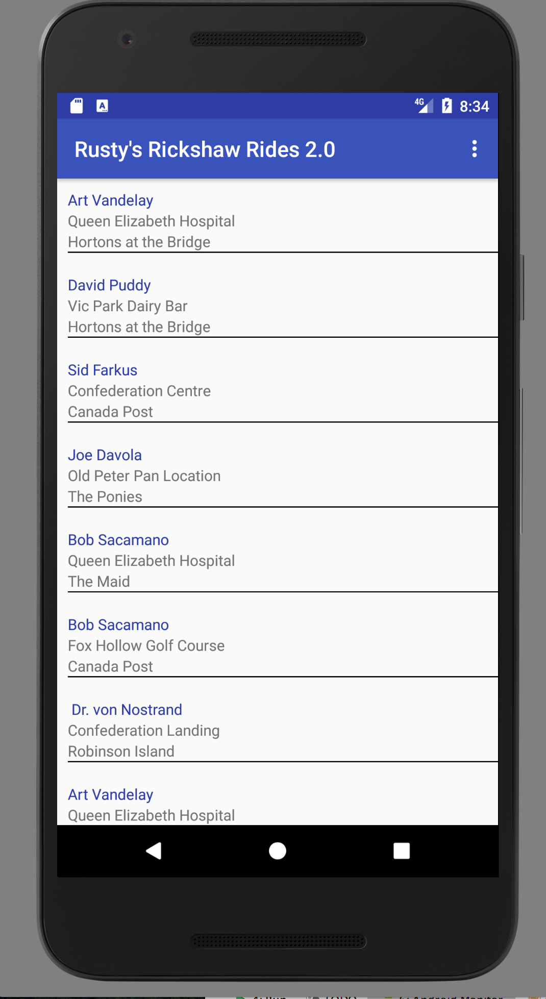
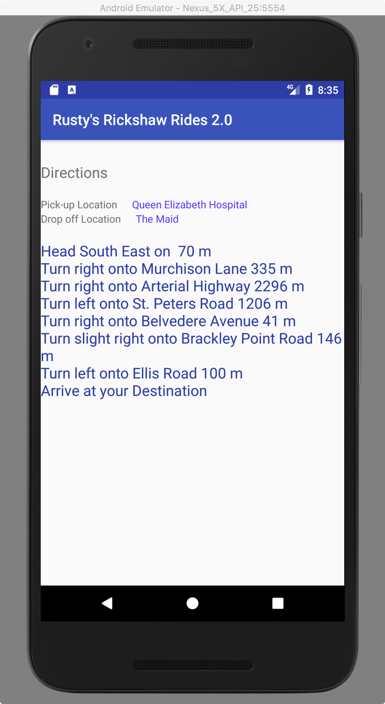

# CS 2130 Assignment 2:

Due: Oct 15, 23:59h

Continuing from Assignment 1. You may continue with your own code, pickup the CS2130-A1 Solution, or code from scratch. Keep in mind this assignment is graded independent of Assignment 1 - meaning deductions from code in assignment 1 are eligible to be deducted again.

Rusty's website is taking off, however the Rickshaw pullers don't like that Rusty is only sending them one customer at a time. They want to be able to choose their next customer. Thus Rusty ever the crowd pleaser implements a new API that allows rickshaw pullers to receive a full list of current customers.

Your job is to write an Android application that talks to Rusty's new API to retrieve a list of all of Rusty's customers. Your program will display a list of customers (from Rusty's website) to the user and allow them to select a particular trip and as before get the turn-by-turn directions and see who the customer is, etc. You'll also now allow the Rickshaw puller to keep track of the rides that they have accepted.

Deliverables:

1. Android App that is built using SDK API 21 designed on an emulator for Nexus 5x also running API 21

2. Functionality
   * A Main Activity loading Rusty's customers into a **RecyclerView** listing all of the customers who are currently looking for rides
     - This activity is launched when your program launches
     - the recycler view will contain the list of customers that rusty sends you as per the API below
     - clicking an item in the recycler view should launch into a screen containing the details of that ride - pickup, drop-off, location, directions
     - you may implement your solution as in Assignment 1 with multiple activities or as in the current examples in class with multiple fragments.
   * The ability for a user to reload the list of customers looking for rides
      - On Thursday we will discuss Menu's which is one way to add an ability to refresh without explicit buttons placed in the UI, menus are also covered in Chapter 13 in the text book.
   * Your app should be robust
      - example: no unexpected crashing
      - example: rotating the device shouldn't lose a customer's information
      - the layout should be readable and logical

3. Coding and design
   * naming conventions followed
   * readability of code
   * design practices mentioned in Class

4. Demonstrated ability to collaborate in the future
   * can you push code to repositories and meet deadlines

Details:

Rusty's new website is accessible at:
http://137.149.157.18/CS2130/rickshaw/?customers=N

where N above is either the word all, i.e.,
http://137.149.157.18/CS2130/rickshaw/?customers=all

(you may assume the above will return no more than 30 customers)

or N is a number giving the maximum number of customers you want Rusty to return i.e.,
http://137.149.157.18/CS2130/rickshaw/?customers=5

(the above will return at most 5 customers)

A call to the API will yield a response in JSON format with the following field:

| field | type | description | example |
|---|---|---|---|
|customers | JSONArray | An array of all of the customers (customer is defined below) looking for rides | [ {"customerName": "Customer Name 1","totalDistance": 3931, "destination": [46.235367, -63.128973], "destinationName": "Canada Post","start": [46.266612, -63.148489],"startName": "Old Peter Pan Location","details": ["Head South East on University Avenue 3513 m","Turn right onto Euston Street 160 m","Turn left onto Queen Street 244 m","Turn left onto Kent Street 13 m","Arrive at your Destination"]}]|

Each entry in the customers array above is as follows (same as Assignment 1):

| field  | type  | description  | example  |
|---|---|---|---|
|  customerName |  String  | Customer's name  | "Andrew"  |
| totalDistance  | int  | Distance of the trip  | 2822 |
| destination  | double []  | [latitude, longitude] of the destination | [46.243321, -63.133369] |
| destinationName  | String  | Where the customer wants to go  |  "Sobey's" |
| start  | double[]  | [latitude, longitude] of the start location | [46.266405, -63.148502]  |
| startName  | String  | Where the customer is being picked up  | "Cow's Ice Cream"  |
| details  | String []  | Step by step directions  | [ "turn right", "go forward", "arrive at destination" ]  |


Example Response (added spaces for readability) where Rusty returns 2 customers:
```JSON
{  
    "customers" : [
                {   "customerName": "Customer Name 1",
                    "totalDistance": 3931,
                    "destination": [46.235367, -63.128973],
                    "destinationName": "Canada Post",
                    "start": [46.266612, -63.148489],
                    "startName": "Old Peter Pan Location",
                    "details": ["Head South East on University Avenue 3513 m",
                                "Turn right onto Euston Street 160 m",
                                "Turn left onto Queen Street 244 m",
                                "Turn left onto Kent Street 13 m",
                                "Arrive at your Destination"
                    ]
                },
                {
                    "customerName": "Customer Name 2",
                    "totalDistance": 3931,
                    "destination": [46.235367, -63.128973],
                    "destinationName": "Canada Post",
                    "start": [46.266612, -63.148489],
                    "startName": "Old Peter Pan Location",
                    "details": [ "Head South East on University Avenue 3513 m",
                                 "Turn right onto Euston Street 160 m",
                                 "Turn left onto Queen Street 244 m",
                                 "Turn left onto Kent Street 13 m",
                                 "Arrive at your Destination"
                    ]
                }          
    ]
}
```

Consult Text Page 487 or In class notes from (Thursday Sept 21 Class) for details on how to parse JSON. It looks tricky at first.
However it is not so bad consider the following code snippet that creates a json object and then parses it back into java types:
```JAVA
        //start with a string: { "name" : "Andrew", "bank pin" : [1, 4, 7, 2] }
        String jsonString = "{ \"name\" : \"Andrew\", \"bank pin\": [ 1, 4, 7, 2] }";
        try {
            //convert string to a JSONObject
            JSONObject myJsonObject = new JSONObject(jsonString);
            //get the array of numbers
            JSONArray bankPins = myJsonObject.getJSONArray("bank pin");
            //get the first pin number -> store into an int
            int firstPinNum = bankPins.getInt(0);
            //get the name -> name
            String name = myJsonObject.getString("name");
        } catch (JSONException e) {
            e.printStackTrace();
        }
```

 Mockups (provided coarsely as examples you are encouraged to develop your own UI)

 

Grading:


| Assessment  | Your Grade   | Max Grade  |
|---|---|---|
| Functionality  | _  | 5  |
| Coding Design  | _  | 4  |
| Effort         | -  | 1  |

* Functionality: Have you covered the list of functionality above and have you done the in a reasonable way (the UI isn't all crammed on top of itself, the program doesn't freeze up, etc)

* Coding Design: readable code, that follows the naming conventions, ex. uses Strings.xml for string literals, names member variables prefaced with *m*

* Effort: 1 Points as follows:
  * Have you completed 2 (or more) pushes to your repository such that the project is in a build-able state.


Due Dates: The Completed Assignment is due as per the deadline noted at the top of this page.

You should check your code into this repository in a directory called Assignment2
```
CS2130-A2-YOURUSERNAME
|   README.md
|   .gitignore
|   mock1.png
|   mock2.png
|___Assignment2
    |   your
    |   android
    |   studio
    |   source
    |   files
```    

I should be able to open and build the Assignment2 folder in Android Studio
